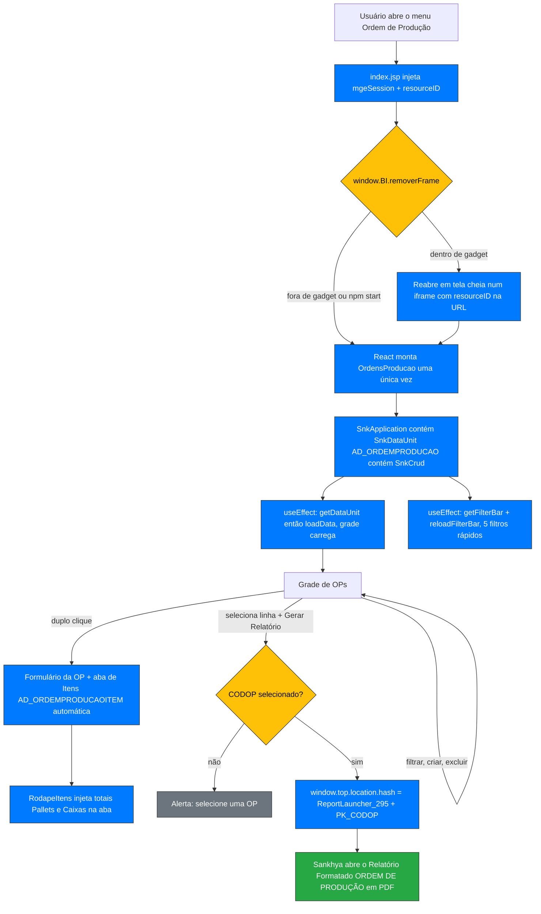

<div align="center">
  
</div>

# 📦 TELA-ORDEM-PRODUCAO — Ordem de Produção (Componente BI em React)

> Tela única e operacional para a **Ordem de Produção** da embalagem de fruta: CRUD completo
> do cabeçalho e dos itens da OP, fila filtrável e impressão da "receita" (Relatório
> Formatado). Roda como **Componente BI (HTML5)** do Sankhya, sem tocar no servidor de
> aplicação.


-blue)


---

## Sobre

Na Argo Fruta, a **Ordem de Produção (OP)** é o documento que o operacional recebe para
embalar um lote de fruta: um cabeçalho (cliente, mercado, pedido, semana, prioridade) e uma
lista de itens (variedade, produto, marca/cinta/etiqueta, calibre, cumbuca, pallets, padrão,
produtor, válvula, data de embalagem). Esse documento sempre foi impresso a partir de dois
cadastros feitos no **Construtor de Telas** (`AD_ORDEMPRODUCAO` e `AD_ORDEMPRODUCAOITEM`).

O problema: eram **duas telas separadas** (uma para o cabeçalho, outra para os itens), com o
visual antigo do ERP, sem fila filtrável e sem um botão direto para gerar o documento
impresso. O planejamento de embalagem virava um vai-e-vem entre telas.

Esta tela substitui as duas por **uma só**, no layout novo do Sankhya (React + Design
System `ez-*`/`snk-*`):

- **uma grade** de OPs que se filtra por código, parceiro, nota, usuário de criação e
  mercado;
- **um formulário** que abre a OP com a **aba de itens junto** — não é mais outra tela;
- **totais de Pallets e Caixas** no rodapé da aba de itens, os mesmos números do rodapé do
  documento impresso;
- **um botão "Gerar Relatório"** que abre a OP selecionada já formatada em PDF (o Relatório
  Formatado "ORDEM DE PRODUÇÃO").

Tudo isso é entregue como **um único `index.jsp` auto-contido** — sobe no cadastro de
Componente BI e funciona, sem microserviço, sem deploy no servidor de aplicação, sem buscar
nenhum arquivo externo em tempo de execução.

---

## 📁 Estrutura do Projeto

```
TELA-ORDEM-PRODUCAO/
├── bi-ordem-producao/               # aplicação React (fork do template Design-System-BI)
│   ├── src/
│   │   ├── index.tsx                # bootstrap: removerFrame + monta o React uma vez
│   │   ├── OrdensProducao.tsx       # SnkApplication > SnkDataUnit(AD_ORDEMPRODUCAO) > SnkCrud + filtros
│   │   ├── Cabecalho.tsx            # barra de cabeçalho (logo Argo + título)
│   │   ├── BarraTarefas.tsx         # botão "Gerar Relatório" na barra de tarefas do SnkCrud
│   │   ├── Rodape.tsx               # componente visual do card de total (rótulo + valor + ícone)
│   │   ├── RodapeItens.tsx          # injeta os totais Pallets/Caixas na aba de itens da OP
│   │   └── sankhya.d.ts             # tipos dos globais da página (window.BI, SANKHYA, resourceID)
│   ├── public/index.html            # template do index.jsp: contexto de sessão + removerFrame
│   ├── scripts/zip.js               # build → pacote → build/bi.zip (index.jsp único)
│   ├── package.json                 # scripts: npm run zip / zip:split
│   └── README.md                    # README do TEMPLATE (Wansley Nery Soto) — não é este doc
├── relatorios/
│   └── OrdemProducao.jrxml          # Relatório Formatado "ORDEM DE PRODUÇÃO" (código 295)
├── docs/
│   ├── Cabeçalho/metadata.xml       # export do Construtor de Telas — entidade AD_ORDEMPRODUCAO (+ relacionadas)
│   ├── Item/metadata.xml            # export do Construtor de Telas — entidade AD_ORDEMPRODUCAOITEM (+ relacionadas)
│   ├── superpowers/specs/           # design spec original (2026-08-19)
│   └── README.md                    # este documento
└── Ordem de Produção.pdf            # modelo do documento impresso (referência de layout)
```

---

## 📚 Referência de Módulos

| Módulo | Função / Export | Descrição |
|--------|-----------------|-----------|
| `index.tsx` | `window.BI.removerFrame({ instancia, resourceID })` | Tira a tela da moldura de gadget e a reabre em tela cheia; injeta o `resourceID` na URL do iframe. Só monta o React **uma vez** (no caminho que sobrevive). |
| `OrdensProducao.tsx` | `RESOURCE_ID` | Identificador de permissão do menu "Ordem de Produção" (`br.com.sankhya.menu.adicional.nuDsb.286.1`). Sem ele a tela abre somente-leitura para usuário não-supervisor. |
| `OrdensProducao.tsx` | `<OrdensProducao />` | Compõe `SnkApplication > SnkDataUnit(entityName="AD_ORDEMPRODUCAO") > SnkCrud`. O CRUD de cabeçalho + a aba de itens vêm prontos do componente. Dois `useEffect`: um dispara `loadData()` no mount, outro configura a barra de filtros. |
| `OrdensProducao.tsx` | `MEUS_FILTROS`, `carregarFiltrosOP()` | 5 filtros rápidos definidos em código (CODOP, CODPARC, NUNOTA, CODUSUARIOCRIACAO, MERCADO). Faz **merge** com o que o usuário salvou no `ConfigStorage` — nunca substitui. |
| `BarraTarefas.tsx` | `gerenciadorBarraTarefas`, `aoClicarNaBarra()` | Adiciona o botão **"Gerar Relatório"** (`BOTAO_RELATORIO`) à barra da grade e trata o clique: monta o hash do `ReportLauncher_295` com o `CODOP` selecionado e troca `window.top.location.hash`. |
| `BarraTarefas.tsx` | `CODIGO_RELATORIO_OP = 295` | Código do Relatório Formatado "ORDEM DE PRODUÇÃO" **neste ambiente**. Conferir em *Relatórios Formatados* após reimportar. |
| `Rodape.tsx` | `<Rodape totais={[…]} />`, `TotalDoRodape` | Renderiza os cards de total no slot `SnkGridFooter`. `valor` trafega como número; a formatação usa `NumberUtils` do `@sankhyalabs/core` (mesmo helper da grade). |
| `RodapeItens.tsx` | `observarRodapeItensOrdem()` | `MutationObserver` que acha o `<snk-detail-view entityName="AD_ORDEMPRODUCAOITEM">` da aba de itens, anexa o `<Rodape>` no `<slot name="SnkGridFooter">` do grid interno e mantém os totais em dia via `dataUnit.subscribe`. |
| `RodapeItens.tsx` | `somarTotaisItens(dataUnit)` | Soma **Pallets** e **Caixas** de todos os itens carregados na aba. |

---

## 🗄️ Objetos de Banco de Dados

> Este projeto **não cria** tabelas, procedures, functions nem índices. As tabelas `AD_*`
> já existem (criadas pelo Construtor de Telas); a tela apenas as consome via BFF do módulo.

### Tabelas envolvidas

| Tabela | Alias | Operação | Descrição |
|--------|-------|----------|-----------|
| `AD_ORDEMPRODUCAO` | OP | **READ / INSERT / UPDATE / DELETE** | Cabeçalho da OP. PK `CODOP` (sequência automática). |
| `AD_ORDEMPRODUCAOITEM` | ITE | **READ / INSERT / UPDATE / DELETE** | Itens da OP. PK `CODOP + CODITEM`. Excluir a OP remove os itens em cascata (`remove="S"` na relação). |
| `TGFPAR` | PAR / PARPROD | READ | Cliente (`OP.CODPARC`) e produtor (`ITE.CODPARC`). |
| `TGFCAB` | — | READ | Pedido vinculado (`OP.NUNOTA` → `CabecalhoNota`). |
| `TSIUSU` | — | READ | Usuário de criação (`OP.CODUSUARIOCRIACAO` → `CODUSU`). |
| `TGFPRO` | PRO / MP / CUMB / CETQ | READ | Produto, variedade, cumbuca e cinta/etiqueta dos itens. |
| `AD_AREAPARC` | AREA | READ | Válvula do produtor (`ITE.CODPARC + ITE.CODAREA`). |
| `AD_CALIBREPRODUTO` | — | READ | Calibre / classificação do item. |

### Campos de `AD_ORDEMPRODUCAO` (cabeçalho)

| Campo | Tipo | Descrição |
|-------|------|-----------|
| `CODOP` | Inteiro (PK, auto) | Código da OP. Somente-leitura. |
| `CODPARC` | Inteiro → `TGFPAR` | Cliente. |
| `NUNOTA` | Inteiro → `TGFCAB` | Pedido vinculado (opcional). |
| `NUMPEDIDOSEMANA` | String | Nº do pedido da semana. |
| `SEMANA` | String | Semana de embalagem. |
| `MERCADO` | String | Mercado (ex.: Europa, Mercado Interno). Filtro tipo *mult-list*. |
| `PRIORIDADE` | Opção | `Alta` / `Media` / `Baixa` (padrão `Baixa`). |
| `DATACARREGAMENTO` | Data/hora | Data de carregamento. |
| `OBSERVACAO` | Texto | Observações da OP. |
| `DTCRIACAO` | Data/hora | Preenchido por `$ctx_dh_atual`. Somente-leitura. |
| `CODUSUARIOCRIACAO` | Inteiro → `TSIUSU` | Preenchido por `$ctx_usuario_logado`. Somente-leitura. |

### Campos de `AD_ORDEMPRODUCAOITEM` (itens)

| Campo | Tipo | Descrição |
|-------|------|-----------|
| `CODOP` + `CODITEM` | Inteiro (PK) | `CODITEM` é sequência automática dentro da OP. |
| `CODPRODMP` | Inteiro → `TGFPRO` | Variedade (`USOPROD='M'`). |
| `CODPROD` | Inteiro → `TGFPRO` | Produto. |
| `CODPRODAD` | Inteiro → `TGFPRO` | Cinta/Etiqueta (grupo `3001001`, descrição com `CINTA`/`ETIQ`). |
| `CODCUMBUCA` | Inteiro → `TGFPRO` | Cumbuca. |
| `CALIBRE` | Opção → `AD_CALIBREPRODUTO` | Calibre / classe. |
| `PADRAO` | Inteiro | Padrão (caixas por pallet). |
| `QTDPALLETS` | Inteiro | Quantidade de pallets. |
| `ETIQUETA` | `S`/`N` | Leva etiqueta? |
| `CODPARC` | Inteiro → `TGFPAR` | Produtor. |
| `CODAREA` | Inteiro → `AD_AREAPARC` | Válvula / área produtiva do produtor. |
| `DTEMBALAGEM` | Data/hora | Data de embalagem do item. |

### Relatório Formatado

| Item | Valor |
|------|-------|
| Nome | `ORDEM DE PRODUÇÃO` |
| Código (neste ambiente) | **295** |
| Classe do launcher | `br.com.sankhya.controls.ReportLauncher_295` |
| Fonte | `relatorios/OrdemProducao.jrxml` |
| Parâmetro | `PK_CODOP` (`BigDecimal`) — `AD_ORDEMPRODUCAO.CODOP` |
| Regra da coluna "QTD. CAIXAS" | `QTDPALLETS × PADRAO` (o `.jrxml` não usa um campo `QTDCAIXAS`) |

---

## 🚀 Guia de Implantação

### 1. Gerar o pacote

```bash
cd bi-ordem-producao
npm ci
npm run zip          # → build/bi.zip  (uma entrada: index.jsp auto-contido)
```

> Precisa de Node 16+. No Windows o empacotamento usa `Compress-Archive`; em Linux/macOS
> usa o binário `zip`. `npm run build` **não** existe neste projeto (é redirecionado para
> `npm run zip`).

### 2. Cadastrar o Componente BI

1. Sankhya → **Componente BI (HTML5)** → novo, subir `build/bi.zip`, `entryPoint = index.jsp`.
2. Anotar o **nome exato** dado ao componente (case sensitive). Em produção o nome é
   **`ORDEM DE PRODUCAO BI`**.
3. Esse nome já está em `src/index.tsx` (`instancia: 'ORDEM DE PRODUCAO BI'`). Se mudar o
   nome do componente, ajuste ali e gere o zip de novo — é o que tira a tela da moldura de
   gadget.

### 3. Permissões (`resourceID`)

O `RESOURCE_ID` em `src/OrdensProducao.tsx` é
`br.com.sankhya.menu.adicional.nuDsb.286.1` — o identificador do próprio menu "Ordem de
Produção". **Sem um `resourceID` válido a tela abre somente-leitura** para todo usuário
não-supervisor (o `snk-application` cai em `unknown.resource.id` e a checagem de permissão
nunca resolve). Se o menu for recriado, atualizar essa constante.

### 4. Liberar acesso

Tela **Acessos** → liberar o Componente BI para os usuários/grupos do operacional de
embalagem.

### 5. Relatório Formatado

1. Importar / confirmar o Relatório Formatado **"ORDEM DE PRODUÇÃO"** a partir de
   `relatorios/OrdemProducao.jrxml`.
2. Conferir o **código** gerado em *Relatórios Formatados*. Se **não** for `295`, atualizar
   `CODIGO_RELATORIO_OP` em `src/BarraTarefas.tsx` e regerar o zip.

### 6. Filtros

Os 5 filtros rápidos são definidos em código e aparecem sozinhos. Filtros personalizados
que o usuário criar pelo **"+ Filtros"** são preservados (o loader faz merge com o
`ConfigStorage`, não substitui).

### 7. Validar em produção

Abrir uma OP real e conferir: grade carrega, filtros aplicam, aba de itens aparece dentro
do formulário, rodapé de Pallets/Caixas aparece embaixo da grade de itens, botão **"Gerar
Relatório"** abre o PDF da OP selecionada.

---

## 🔄 Fluxo de Execução



---

## ⚠️ Observações Importantes

- **`resourceID` é obrigatório.** Sem ele, tela somente-leitura para não-supervisor. O valor
  é o identificador do menu — muda se o menu for recriado.
- **Filtros em código fazem merge, nunca substituem.** `customFilterBarConfig` roda a cada
  recarga da barra (inclusive depois de salvar um filtro personalizado). Um loader que
  devolvesse só os 5 campos fixos apagaria em silêncio o filtro que o usuário acabou de
  criar. Por isso `carregarFiltrosOP` chama o `ConfigStorage` real e só acrescenta o que
  faltar.
- **`getFilterBar()` do SnkCrud não enfileira a chamada** como o `getDataUnit()` faz —
  chamado cedo demais ele **lança exceção** e trava o gadget em "Aguarde...". Daí o retry
  com backoff (15 tentativas / 300 ms) no `useEffect`.
- **`props.expression` é obrigatório em cada filtro** (`this.<CAMPO> = :<CAMPO>`). Sem ele o
  clique em "Aplicar" quebra em silêncio, sem erro visível e sem requisição. Filtros
  `SEARCH` (CODPARC, CODUSUARIOCRIACAO) ainda precisam de `props.searchContext`.
- **Botão com ícone + texto: `hint` e `text` chegam trocados.** A lib passa o 5º argumento
  como label visível e o 6º como tooltip. Os valores em `BOTAO_RELATORIO` já estão na ordem
  que a lib espera — não "corrigir".
- **Código `295` do relatório é específico do ambiente.** Reimportar o `.jrxml` pode gerar
  outro código; conferir em *Relatórios Formatados*.
- **"QTD. CAIXAS" = `QTDPALLETS × PADRAO`.** É assim que o `.jrxml` calcula (não há campo
  `QTDCAIXAS` na tabela). O rodapé de itens da tela deve usar a mesma regra.
- **Entrega é um `index.jsp` único (~4,6 MB).** Se o container recusar ("code too large"),
  usar `npm run zip:split` (gera `index.jsp` + `bi.js`).
- **`mgeSession` é montado pela página.** O BFF (`mgefin-bff`) tem contexto de sessão
  próprio; sem o `mgeSession` correto na URL do GraphQL o BFF responde `401`. Isso está
  resolvido em `public/index.html` — não mexer.
- **`package-lock.json` é versionado** de propósito (builds reprodutíveis com `npm ci`).

---

## 📋 Changelog

| Versão | Data | Descrição | Autor |
|--------|------|-----------|-------|
| 0.1.0 | 2026-08-19 | Spike: `SnkCrud` mínimo ligado a `AD_ORDEMPRODUCAO` para validar o `entityName` contra o BFF | Natan |
| 1.0.0 | 2026-08-27 | Primeira versão em produção: CRUD de cabeçalho + aba de itens automática, 5 filtros rápidos em código (com merge no `ConfigStorage`), botão "Gerar Relatório" (Relatório Formatado 295), rodapé de Pallets/Caixas na aba de itens, cabeçalho com logo Argo, `removerFrame` com injeção de `resourceID` | Natan |

---

## 👤 Autor

**Francisco Natanael Lopes Vasconcelos (Natan)**
- 🏢 Grupo Argo (Argo Fruta)
- 📧 natanael.lopes@argofruta.com
- 🐙 [GitHub](https://github.com/GrupoArgoFruta)

---

## 🙏 Crédito de terceiros

A aplicação em `bi-ordem-producao/` é um fork do template open-source
[**Design-System-BI**](https://github.com/wansleynery/Design-System-BI) (Wansley Nery Soto).
Os termos de licença e os créditos completos estão em `bi-ordem-producao/README.md`.
